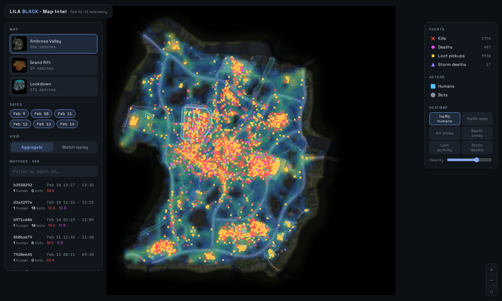

# LILA BLACK — Map Intel

A web tool for Level Designers to explore how players actually move, fight,
loot, and die across LILA BLACK's three maps, built from 5 days of production
telemetry (Feb 10–14, 2026).

**Live deployment:** `https://<your-deployment>.vercel.app` ← replace after deploy



## Tech stack

- **Pipeline:** Python 3.10+ · pyarrow · pandas · Pillow (offline, build-time)
- **Frontend:** React 18 · Vite 6 · hand-rolled canvas renderer (no chart libs)
- **Hosting:** Vercel (static — no server, no database)
- **Env vars:** none

## Repo layout

```
pipeline/            parquet → static JSON (build.py, prepare_minimaps.py, config.py)
public/data/         processed outputs (committed, so the app deploys as-is)
public/minimaps/     1024×1024 web minimaps (committed)
src/                 React app
ARCHITECTURE.md      design decisions, coordinate mapping, assumptions
INSIGHTS.md          three data-backed findings about the game
```

Raw telemetry is **not** committed. To re-run the pipeline, unzip
`player_data.zip` so the folder sits at `raw/player_data/`.

## Setup

```bash
npm install
npm run dev            # app at http://localhost:5173 (uses committed data)
npm run build          # production build → dist/
```

Re-processing the raw data (only needed if the dataset changes):

```bash
pip install pyarrow pandas pillow
npm run pipeline       # expects raw/player_data/ ; rewrites public/data + minimaps
```

## Deploy (Vercel)

1. Push this repo to GitHub.
2. Vercel → New Project → import the repo. The Vite preset is auto-detected
   (build `npm run build`, output `dist`). No env vars.
3. Deploy. The processed data ships with the build — nothing else to configure.

## Using the tool (feature walkthrough)

**Aggregate view** (default) — the "where does everything happen" view.
- Pick a **map** (left rail) and toggle **date chips** to set the range.
- Every kill (✕), death (◆), loot pickup (▪) and storm death (▲) in range is
  plotted. Toggle event types and human/bot actors in the right panel — the
  toggles double as the legend, with live counts.
- Switch on a **heatmap** (right panel): human/bot traffic, kill zones, death
  zones, loot activity, storm deaths. Log-scaled, with an opacity slider.
- **Hover** any dot for details; **click** it to jump into that match's replay.

**Match replay** — the "watch one match unfold" view.
- Pick any match in the left-rail browser (sorted most-interesting-first;
  searchable by id). Human/bot counts and K/D/storm chips shown per match.
- Press **play** (or space). Bright trails show where players have been, faint
  lines where they'll go; humans are coloured with a ring, bots thin grey.
  Event markers pop in as the clock passes them.
- The **timeline carries a tick per event** (red kills, magenta deaths, purple
  storm, faint amber loot) so you can see when the action happens and scrub
  straight to it. Speeds: 1× / 4× / 16×.
- Toggle individual players in the "In this match" roster.

**Sharing** — map, dates, heatmap layer, and open match are encoded in the
URL hash. Copy the address bar to send a colleague the exact view, e.g.
`#map=Lockdown&heat=traffic_h` or `#map=AmbroseValley&match=<id>`.

## Data notes

The raw telemetry has several quirks (mistyped timestamps, a duplicated
journey file, minimap images at the wrong documented resolution). All are
detected and handled in the pipeline; see **ARCHITECTURE.md** for the full
list and `public/data/validation.json` for the anomaly report of the current
build.
